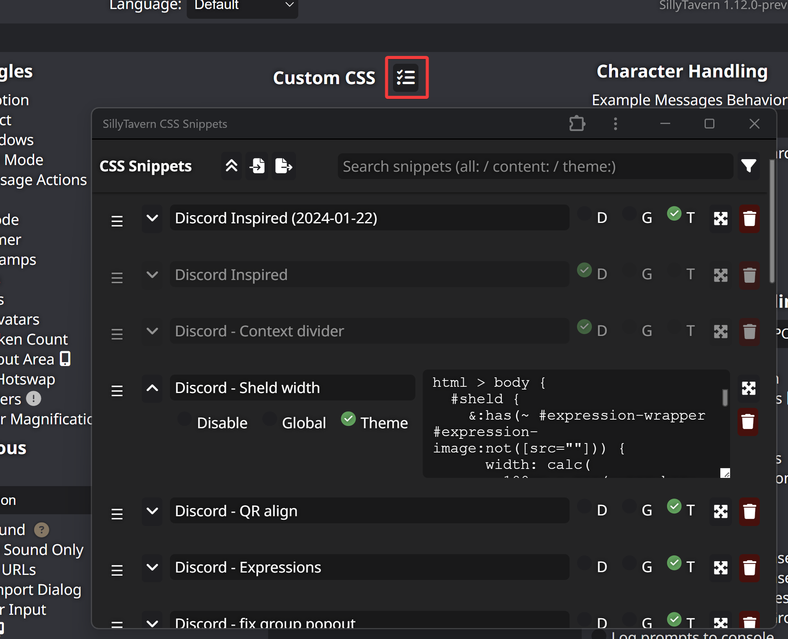

# CSS Snippets

Adds a UI to manage custom CSS snippets.

Snippets can be globally activated, linked to a specific theme, or linked to a specific chat (character / group).

## Installation

Use ST's inbuilt extension installer with this URL:  
https://github.com/LenAnderson/SillyTavern-CssSnippets/

## Usage

Open **User Settings** and click on the button next to **Custom CSS**
